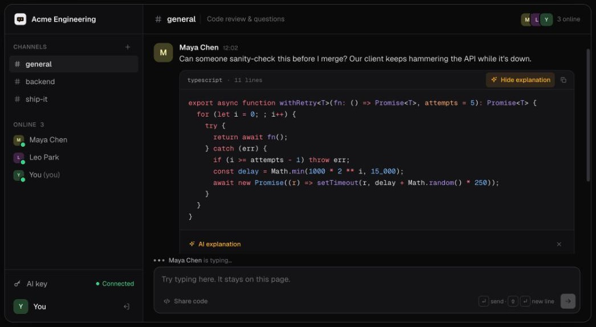
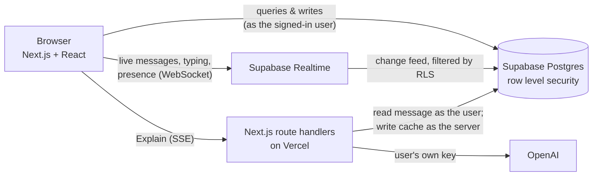

<div align="center">

# DevChat

**Team chat that speaks code: syntax-highlighted snippets and streamed AI explanations, right in the thread.**

[**Live demo →**](https://dev-chat-virid.vercel.app) &nbsp;·&nbsp; one click, no signup &nbsp;·&nbsp; [Deployment guide](./DEPLOYMENT.md)

[](https://github.com/shihabcodes/DevChat/actions/workflows/ci.yml)




</div>

## What it is

Developers paste code into Slack, then copy it into ChatGPT to ask what it does. DevChat puts both in one place. You share code in a channel, it's highlighted properly, and anyone in the channel can click **Explain** to stream an AI breakdown under the snippet. Once explained, the answer is cached, so teammates get it instantly.

**Try it:** open the [live demo](https://dev-chat-virid.vercel.app) and click **Try Demo**. You get a private guest workspace, deleted after 24 hours. Open it in a second window to watch messages, typing indicators and presence sync live.

## Features

- **Real-time channels**: live messages, edits and deletes, typing indicators, and who's online, with optimistic sends, retry, and backfill after reconnects
- **Full history**: scroll up to page back through older messages; the view keeps your place
- **Keyboard-first**: ⌘K to jump between channels, ↵ to send, ⌘↵ for code
- **Code as a first-class message**: a Monaco editor for writing snippets, and Shiki highlighting across 20 languages
- **Streamed AI explanations**: bring your own OpenAI key; answers stream in over SSE and are cached per message
- **Workspaces & channels**, joined with an invite code that owners can rotate
- **Sign in with Google** or email, or try a **one-click guest demo** built on anonymous auth and cleaned up automatically by a database cron job

## Architecture



There's no custom backend server. The browser talks to Supabase directly, and **Postgres row level security is the authorization layer**. The only server code is two route handlers for the AI feature, because they need secrets.

## Engineering highlights

**Authorization lives in the database.** Every table has RLS policies built on one rule: you can see a workspace's channels, messages, members and AI answers only if you're a member. Helper functions live in a non-exposed `private` schema, and multi-row writes (create workspace, join by invite) are `SECURITY DEFINER` RPCs. Column-level grants stop users from editing anything but the fields they should, such as a message's content but not its author or channel.

**Policies are tested, not assumed.** [`supabase/tests/rls_test.sql`](./supabase/tests/rls_test.sql) creates throwaway users (an owner, a member, and an outsider), attempts 37 allowed and forbidden actions against the real project, and cleans up after itself. For example: outsiders reading messages, members promoting themselves, planting fake AI answers, and reading stored API keys.

**Realtime without a socket server.** Messages come from Postgres change feeds, and typing and presence use Realtime broadcast and presence. All topics are private, and access is gated by the same membership check as the tables. When a subscription drops and recovers, the client backfills the channel so nothing sent during the gap is lost.

**AI with the user's key, safely.**
- The key is verified with OpenAI, encrypted with AES-256-GCM on the server, and never returned to the browser.
- The explain route reads the message *as the requesting user*, so RLS blocks anyone outside the workspace.
- Only the server can write the explanation cache.
- Each user is limited to 30 explanations per hour.

**Abuse limits in the right layer.** Message spam is capped at 10 per 10 seconds by a Postgres trigger. Sign-ups and guest sign-ins use Supabase's per-IP limits. A `pg_cron` job purges demo guests and everything they created.

## Tech stack

| | |
|---|---|
| **App** | Next.js 15 (App Router), React 19, TypeScript, Tailwind CSS 4 |
| **Data & auth** | Supabase: Postgres, Auth (Google, email, anonymous), Realtime, pg_cron |
| **AI** | OpenAI via Next.js route handlers, streamed with Server-Sent Events |
| **Code** | Shiki for highlighting, Monaco for editing |
| **Hosting** | Vercel + Supabase, both on free tiers |
| **CI** | GitHub Actions (type check + build), CodeQL |

## Running locally

```bash
git clone https://github.com/shihabcodes/DevChat.git
cd DevChat

# 1. Database: link your Supabase project and apply migrations
supabase login
supabase link --project-ref <your-project-ref>
supabase db push

# 2. App
cd client
cp .env.example .env.local   # fill in the values described inside
npm install
npm run dev                  # http://localhost:3000
```

In Supabase → Authentication, turn on **anonymous sign-ins** so the demo works. [DEPLOYMENT.md](./DEPLOYMENT.md) has the full setup, including Vercel.

To check the security policies against your project:

```bash
supabase db query --linked -f supabase/tests/rls_test.sql   # every row should say pass = true
```

## Project structure

```
client/                      Next.js app
  src/app/                   pages (/, /workspace/[id]) and /api/ai route handlers
  src/components/            chat UI: sidebar, messages, code blocks, input, AI settings
  src/lib/                   Supabase client, data access, realtime hooks, AI helpers
  src/lib/server/            server-only code: admin client, auth check, encryption
supabase/
  migrations/                schema, RLS policies, realtime authorization, cron jobs
  tests/rls_test.sql         allow/deny tests for every policy
```

## Roadmap

- [ ] Threads and reactions
- [ ] Full-text search
- [ ] Let guests keep their demo workspace by signing up
- [ ] End-to-end tests with Playwright

## Author

Built by **Shihab** ([@shihabcodes](https://github.com/shihabcodes)). Feedback and issues are welcome.

## License

[MIT](./LICENSE)
